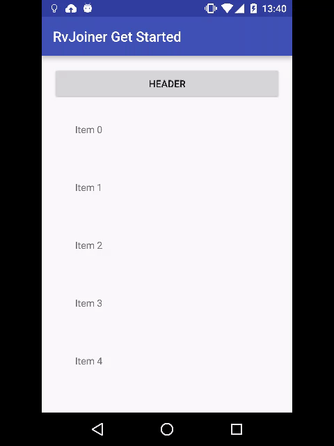

# Android RecyclerView Joiner Library

This library provides you a functionality of joining together several adapters and layouts into a single RecyclerView. The result of joining will be an [adapter](http://developer.android.com/intl/ru/reference/android/support/v7/widget/RecyclerView.Adapter.html), which you can set to your RecyclerView. Actually, this library allows you to construct multitype adapter from separate parts (such as an adapters and layouts). This approach gives you next advantages:
* More flixibility of using adapters (they also can be used separately or in different constructions)
* You can dynamically change your RecyclerView structure by adding and removing parts programmatically
* Add header, footer, or devider layout without adding a new item type to your adapter

For example, you can combine two adapters and use title layout to separate them, like in [full demo app](full-demo-app):

## Get started

Get started app [source code](get-started-app)

### Dependencies

Configure dependencies in you <b>module</b> build.gradle file. [Example](get-started-app/build.gradle)

<pre><code>
dependencies {
    //your other dependencies
    compile 'su.j2e:rv-joiner:1.0.5'//latest version by now
}
</code></pre>

<b>NOTE:</b> You need to use <b>jCenter</b> repositiory to do this ([example](build.gradle)).

See [releases](../../releases) for new versions.

### Add RecyclerView to your xml

We need [RecyclerView](http://developer.android.com/intl/ru/reference/android/support/v7/widget/RecyclerView.html). Not surprising. 
[Example](get-started-app/src/main/res/layout/activity_main.xml)

### Create an adapter if you've not

You need just your [RecyclerView.Adapter](http://developer.android.com/intl/ru/reference/android/support/v7/widget/RecyclerView.Adapter.html), nothing special (except of getting your view or view holder position, see <b>Cautions</b> section). 
[Example](get-started-app/src/main/java/su/j2e/rvjoiner/getstarted/MyAdapter.java)

### Create xml layout if needed

You can join your layout to recycler view. Just a usual xml layout, no magic. [Example](get-started-app/src/main/res/layout/header.xml)

### Do the magic!

Usage example from get started [source](get-started-app/src/main/java/su/j2e/rvjoiner/getstarted/MainActivity.java):

<pre><code>
//init your RecyclerView as usual
RecyclerView rv = (RecyclerView) findViewById(R.id.rv);
rv.setLayoutManager(new LinearLayoutManager(this));

//construct a joiner
RvJoiner rvJoiner = new RvJoiner();
rvJoiner.add(new JoinableLayout(R.layout.header));
rvJoiner.add(new JoinableAdapter(new MyAdapter()));
rvJoiner.add(new JoinableLayout(R.layout.devider));
rvJoiner.add(new JoinableAdapter(new MyAdapter()));
rvJoiner.add(new JoinableLayout(R.layout.footer));

//set join adapter to your RecyclerView
rv.setAdapter(rvJoiner.getAdapter());
</code></pre>

Thats it! Result looks like this:

That's only the basic usage. Check [full demo app](full-demo-app) and read <b>Extra customization</b> section to learn how to bring more customization into your app with joiner.

## Cautions

### Getting view or ViewHolder position (or type)

Be careful when using these methods of RecyclerView:
* [getChildAdapterPosition(View child)](http://developer.android.com/reference/android/support/v7/widget/RecyclerView.html#getChildAdapterPosition(android.view.View))
* [getChildLayoutPosition(View child)](http://developer.android.com/reference/android/support/v7/widget/RecyclerView.html#getChildLayoutPosition(android.view.View))
* [getChildPosition(View child)](http://developer.android.com/reference/android/support/v7/widget/RecyclerView.html#getChildPosition(android.view.View))

and these methods of RecyclerView.ViewHolder
* [getAdapterPosition()](http://developer.android.com/reference/android/support/v7/widget/RecyclerView.ViewHolder.html#getAdapterPosition())
* [getItemViewType()](http://developer.android.com/reference/android/support/v7/widget/RecyclerView.ViewHolder.html#getItemViewType())
* [getLayoutPosition()](http://developer.android.com/reference/android/support/v7/widget/RecyclerView.ViewHolder.html#getLayoutPosition())
* [getOldPosition()](http://developer.android.com/reference/android/support/v7/widget/RecyclerView.ViewHolder.html#getOldPosition())
* [getPosition()](http://developer.android.com/reference/android/support/v7/widget/RecyclerView.ViewHolder.html#getPosition())

returns <b>JOINED</b> position and <b>JOINED</b> type. I've named joined values the values, which were assigned to items after joining. Joined adapter has item positions from 0 to sum of joined adapter sizes and unique type id for every real type in joined adapters. But often we need real position of view or view holder in adapter (for ex. when reacting on click). To get real position (real type and other info) for joined position you can use RvJoiner.getPositionInfo(joinedPosition). Also it can be useful to hide this dependency in a wrapper class (to avoid code modifications if decide to use this adapter without joiner). I wrote RvJoiner.RealPositionProvider for you. You can see usage example in [full demo app](full-demo-app/src/main/java/su/j2e/rvjoiner/demo/list/IssuesAdapter.java).

<b>Good news:</b> you can use getItemId() for ViewHolder and getChildItemId(View child) for RecyclerView, this methods works as expected (or not as expected, if you forget to support stable ids).

### Supporting stable ids

If you want to [setHasStableIds(true)](http://developer.android.com/reference/android/support/v7/widget/RecyclerView.Adapter.html#setHasStableIds(boolean)) in your adapter, do this in constructor of your adapter, or use JoinableAdapter constructor to achieve this. If you set it in other time, you will get an error, because RvJoiner adds data observers to your adapter.

Also don't forget to set has stable ids for joined adapter in RvJoiner constructor (it's the only way to do this). And the last thing: don't forget to support stable ids in all joined adapters (otherwise, unpredictable behaviour can occurs).

## Extra customization

I'm working on this topic and more detailed description, but all examples already ready and works. Check [Full Demo App source](full-demo-app). I hope it helps.

## License

Library is distributed under Apache 2.0 license, see [LICENSE.txt](LICENSE.txt)

Enjoy!
