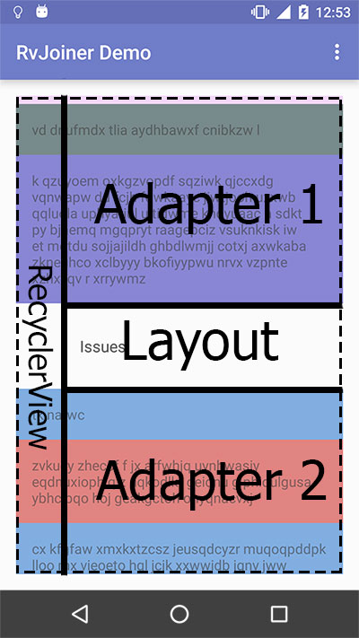

# Android RecyclerView Joiner Library

This library provides you a functionality of joining together several adapters and layouts into a single RecyclerView. The result of joining will be an [adapter](http://developer.android.com/intl/ru/reference/android/support/v7/widget/RecyclerView.Adapter.html), which you can set to your RecyclerView. Actually, this library allows you to construct multitype adapter from separate parts (such as an adapters and layouts). This approach gives you next advantages:
* More flixibility of using adapters (they also can be used separately or in different constructions)
* You can dynamically change your RecyclerView structure by adding and removing parts programmatically
* Add header, footer, or devider layout without adding a new item type to your adapter

For example, you can combine two adapters and use title layout to separate them, like in demo app:

## Get started

Get started app [source code](get-started-app)

### Dependencies

Configure dependencies in you <b>module</b> build.gradle file ([example from get started app](get-started-app/build.gradle)):

<pre><code>
repositories {
    maven {
        url 'https://dl.bintray.com/j2esu/maven/'
    }
}

dependencies {
    //your other dependencies
    compile 'su.j2e:rv-joiner:1.0.3'//latest version by now
}
</code></pre>

See [releases](../../releases) for new versions.

### Add RecyclerView to your xml

We need [RecyclerView](http://developer.android.com/intl/ru/reference/android/support/v7/widget/RecyclerView.html). Not surprising.

[Layout](get-started-app/src/main/res/layout/activity_main.xml) from get started app.

### Create an adapter if you've not

You need just your [RecyclerView.Adapter](http://developer.android.com/intl/ru/reference/android/support/v7/widget/RecyclerView.Adapter.html), nothing special (except of getting your view or view holder position, see <b>Cautions</b> section).

Here is the [source code](get-started-app/src/main/java/su/j2e/rvjoiner/getstarted/MyAdapter.java) of get started app adapter.

### Create xml layout if needed

You can join your layout to recycler view. Just a usual xml layout, no magic.

Header example from get started app [here](get-started-app/src/main/res/layout/header.xml).

### Do the magic!

Usage example from get started ([source](get-started-app/src/main/java/su/j2e/rvjoiner/getstarted/MainActivity.java)):

<pre><code>
//init your RecyclerView as usual
RecyclerView rv = (RecyclerView) findViewById(R.id.rv);
rv.setLayoutManager(new LinearLayoutManager(this));

//construct a joiner
RvJoiner rvJoiner = new RvJoiner();
rvJoiner.add(new JoinableLayout(R.layout.header));
rvJoiner.add(new JoinableAdapter(new MyAdapter()));
rvJoiner.add(new JoinableLayout(R.layout.devider));
rvJoiner.add(new JoinableAdapter(new MyAdapter()));
rvJoiner.add(new JoinableLayout(R.layout.footer));

//set join adapter to your RecyclerView
rv.setAdapter(rvJoiner.getAdapter());
</code></pre>

Result looks like this:
!(Get started app)[img/readme-2.gif]

### Cautions
